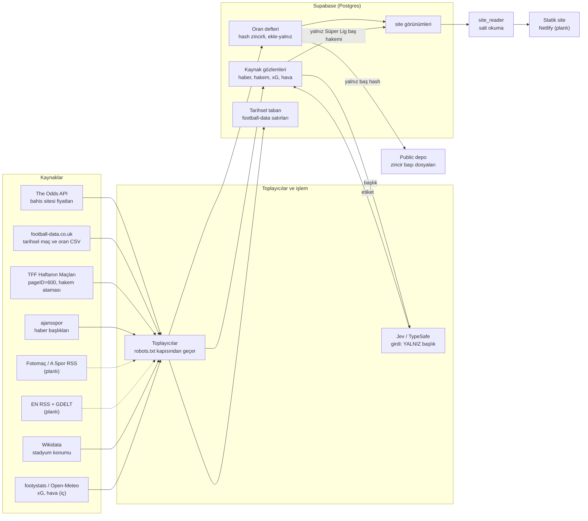

# Hukuk danışma paketi — Goool (football-edge)

**Tarih:** 2026-10-04 (güncellendi 2026-10-05: §2 son paragraf, S1 bağlamı, S8 eki — haber hattı ve Jev canlıda) ·
**Durum:** GÖNDERİLDİ ve YANITLANDI 2026-10-05 — avukat "sorun yok" (kullanıcı beyanı; ayrıntı `docs/phases/06-site/HANDOFF.md` AK13) · **Hazırlayan:** proje sahibi adına
asistan (yalnız derleme; görüşme ve gönderim proje sahibinde)

> **Hukuk tavsiyesi değildir.** Bu belge soru sorar; hiçbir soruya cevap vermez ve varsayım olarak yazılan her
> şey avukatın düzeltmesine açıktır. Koşul özetleri bizim okumamızdır (dayanak raporlar §5'te).
>
> **Gizlilik / yayın durumu:** site **yayımlanmadı**. Yalnız geliştiricinin bilgisayarında yerel olarak derlenip
> gezildi; arama motorlarına kapalıdır (`noindex`, site haritası dışı), alan adı henüz alınmadı. İlk yayın ve
> indekslemeye açma bu paketin yanıtına bağlıdır. Kaynak kod deposu herkese açıktır (GitHub, public) — bu
> belge de o depoda durur; bu yüzden içinde kişi adı, iletişim adresi ya da gizli anahtar yoktur.

---

## 1. Proje bir paragrafta

**Goool**, futbol maçları için bahis piyasasının "konsensüs olasılığını" gösteren, ücretsiz, bilgi amaçlı bir
web sitesidir. Birden çok bahis sitesinin fiyatlarından, bahis sitesinin kâr payı ("vig" ya da marj: fiyatlara
gömülü komisyon) çıkarılarak her sonuç için tek bir olasılık hesaplanır (ör. "ev sahibi %43"). Site **bahis
kabul etmez, ziyaretçiyi hiçbir bahis sitesine yönlendirmez, bahis sitesine bağlantı içermez, bahis sitesi adı
ya da fiyatı göstermez, tavsiye/"banko" yayımlamaz.** Kaydedilen fiyatlar, sonradan değiştirilemeyecek biçimde
"hash zincirli bir defterde" tutulur (her kayıt bir öncekinin parmak izini taşır; zincirin başı düzenli olarak
herkese açık depoya yazılır) ve sitede yalnız bu parmak izleri yayımlanır. "Şeffaf sicil" sayfası, ileride
yayımlanacak tahminlerin kapanış fiyatına göre başarısını gösterecek; bugün yayımlanmış tahmin sayısı **0**'dır
(model piyasayı geçmedi). Diller: **İngilizce + Türkçe**. Gelir modeli yok (reklam, ortaklık/affiliate,
abonelik, analitik yok). Alan adı henüz alınmadı. İşletmecinin hukuki yapısı (gerçek kişi / şirket) henüz
belirlenmedi.
**Yayın, avukat onayına bağlıdır.**

## 2. Veri akışı

Teknik terimler: **toplayıcı** = kaynaktan veriyi çeken küçük program · **Supabase (Postgres)** = projenin
bulut veritabanı (belgelerimizde AB/Frankfurt bölgesi) · **`site_reader`** = yalnız okuma yetkisi olan,
yalnız siteye açılacak görünümleri görebilen veritabanı kullanıcısı · **statik site** = önceden üretilmiş HTML
dosyaları; sunucuda kod çalışmaz, ziyaretçi verisi toplanmaz · **Netlify** = planlanan barındırma şirketi
(henüz hesap yok) · **Jev / TypeSafe** = metinden yapılandırılmış yargı çıkaran harici bir yapay zekâ dil
modeli hizmeti (yalnız iç kullanım).

**Sitede GÖRÜNEN** (hepsi yukarıdaki `site görünümleri`nden): lig ve takım adları; maç başlama anı; 1X2 için
açılış/son/kapanış konsensüs olasılığı ve hareketi; fiyatı alınan bahis sitesi **sayısı** (adları değil);
kapanış kaydedildi/bekleniyor durumu; **Süper Lig maçlarında TFF baş hakeminin adı** ("Hakem: X (TFF ataması)");
sicil sayfası (yayımlanmış tahmin 0; defter satır sayısı, zincir başı hash'i, depodaki son çıpa dosyasının adı);
yasal taslak metinler ("TASLAK — avukat onayı bekler" başlıklı).

**YALNIZ İÇ KULLANIM** (sitede ve depoda yok): bahis sitesi adları ve ham fiyatları (defterde); football-data
CSV satırları (yalnız model eğitimi ve geriye dönük test; depoya ve kayıtlara girmez, yapay zekâya verilmez);
haber başlıkları ve Jev etiketleri (toplayıcı bugün başlık + bağlantı + zaman saklar; şemada gövde alanı var,
bugün boş); footystats xG, Open-Meteo hava durumu, Wikidata stadyum konumu; model tahminleri. **2026-10-04'ten beri**
TR (ajansspor, Fotomaç, A Spor) ve EN (Sports Mole, The Independent, Evening Standard, Football Oranje) RSS
toplayıcıları 2 saatte bir çalışıyor; GFFN veri merkezi IP'sinden engelli olduğu için fiilen toplanmıyor. GDELT
erişilemedi (hız sınırı) ve planda değil. **2026-10-05'ten beri** yalnız Türkçe başlıklar Jev/TypeSafe'e ücretli
olarak gönderiliyor (S1, S8 eki).

**Public depoda bilinmesi gerekenler:** kaynak kod; zincir başı dosyaları; test amaçlı sayfa kopyaları
(TFF'nin iki tam sayfası — hakem adları dahil, kırpılmadı; ajansspor site haritasının bir kopyası — ~40 gerçek
haber başlığı, bazıları oyuncu adı içerir; footystats bir sayfa). Dil kalibrasyonu için etiketlenen başlık
metinleri depoda **değil**, yerelde tutuluyor (depoda yalnız kimlik + etiket).

## 3. Sorular (öncelik sırasıyla)

Her soru: **Bağlam** · **Soru(lar)** · **Dayanak**. Kısaltma: "taslak" = §5'teki yasal taslak metinler.

### S1. Sakatlık haberleri = sağlık verisi mi? (KVKK md. 6, GDPR md. 9)
- **Bağlam:** Haber hattı (TR: ajansspor, Fotomaç, A Spor; EN: dört RSS, §2) sakatlık/cezalı haberlerini de
  içeren başlıkları saklıyor ve maç öncesi sinyal için yurt dışındaki bir yapay zekâ hizmetine (Jev/TypeSafe;
  sunucu konumu doğrulanmadı) **yalnız başlık** olarak **gönderiyor** (2026-10-05'ten beri, yalnız Türkçe; EN dil
  kalibrasyonu bitince İngilizce de). Sitede oyuncu düzeyinde hiçbir bilgi
  yayımlanmaz; özellikler takım düzeyinde toplulaştırılacak. İleride yapılandırılmış "sakat/cezalı" verisi
  sağlayan ücretli bir API (deneme planlı) ve resmî kulüp hesaplarının gönderileri de gündemde.
- **Sorular:** (a) Kamuya açık haberdeki "X oyuncusu sakatlandı" bilgisi KVKK md. 6 anlamında özel nitelikli
  kişisel veri midir; "alenileştirme" (md. 6/3) burada uygulanabilir mi? (b) Saklama + yapay zekâ ile işleme
  için hangi hukuki sebep gerekir; açık rıza zorunlu mu? (c) Başlığın yurt dışındaki bir yapay zekâ hizmetine
  gönderilmesi yurt dışına aktarım mıdır, ne gerektirir? (d) Takım düzeyinde toplulaştırma, saklama süresi
  sınırı ya da oyuncu adlarının ayıklanması riski giderir mi? (e) VERBİS kaydı / veri envanteri gerekir mi?
  (f) Bir sosyal ağ API'sinin "kullanıcının sağlık bilgisini çıkarsama yasağı" kulüp duyurusundan oyuncu
  sakatlığı türetmeyi kapsar mı?
- **Dayanak:** `docs/reports/2026-09-23-ek-kaynaklar.md` "Açık sorular" 1–2; `docs/HANDOFF.md` K/7/1; taslak
  `en-privacy` / `tr-privacy` "Sağlık verisi" [AVUKAT SORUSU].

### S2. Türkiye'de bahis içeriği riski (7258 sayılı Kanun ve reklam mevzuatı)
- **Bağlam:** Türkiye'de yalnız devlet lisanslı bahis yasaldır; yasa dışı bahsin tanıtımı/kolaylaştırılması
  yaptırıma ve erişim engeline konu olabiliyor. Site yurt dışı bahis sitelerinin fiyatlarından türetilmiş
  (marjsız) olasılık yayımlıyor; bahis sitesi adı, fiyatı, bağlantısı, tavsiye yok. Marka adı bilerek "bahis/
  bet/iddaa" içermiyor. 18+ kapısı bir onay penceresidir, yaş doğrulaması değildir. Türkçe dilinde yayın planlı.
- **Sorular:** (a) Yurt dışı bahis fiyatlarından türetilmiş olasılığı Türkçe yayımlamak, ad/bağlantı olmasa da
  yasa dışı bahsin reklamı, teşviki ya da "yer temini" sayılabilir mi? (b) "Kitap sayısı: 21" gibi bir sayı ya da
  "piyasa konsensüsü" ifadesi riski değiştirir mi? (c) 18+ penceresi ve "bahis kabul etmez" şeridi yeterli mi;
  daha güçlü bir yaş kapısı gerekir mi? (d) TR dilinde yayın riski ne kadar artırır; yalnız İngilizce başlamak
  anlamlı bir fark yaratır mı? (e) Erişim engeli riskine karşı alan adı / marka seçiminde dikkat edilecekler?
  (f) İleride kâr amacı (reklam, ortaklık) eklenirse değerlendirme nasıl değişir? (g) İngilizce sürüm için
  Birleşik Krallık reklam kuralları gibi başka ülke çerçeveleri ayrı inceleme gerektirir mi?
- **Dayanak:** `docs/superpowers/specs/2026-09-23-faz6-iz-b-design.md` §10.3, §10.2; `docs/HANDOFF.md` K/7/2;
  ekran görüntüleri 01, 02, 04, 06.

### S3. KVKK aydınlatma, 18+ onayının tarayıcıda saklanması, barındırıcı kayıtları
- **Bağlam:** Sitede hesap, form, yorum, bülten, analitik ve çerez yok. 18+ onayı, ziyaretçinin kendi
  tarayıcısında `localStorage` denen yerel depoda tek bir girdi olarak (`fe-age-18`) tutulur; sunucuya gitmez.
  Tam ekran onay penceresi, onaydan önce yasal metinlere bağlantı vermiyor. Barındırıcı (Netlify, ABD merkezli;
  hesap henüz yok) hizmetini işletmek için IP içeren erişim kayıtları tutabilir. Türkçe gizlilik sayfasının
  başlığı "KVKK aydınlatma metni ve gizlilik" ama metinde veri sorumlusunun kimliği/iletişimi, amaç, hukuki
  sebep, md. 11 hakları ve başvuru yolu yok.
- **Sorular:** (a) Bu başlıkla hangi aydınlatma unsurları zorunludur; işletmeci gerçek kişi olursa kimlik ve
  iletişim nasıl gösterilmeli? (b) `fe-age-18` "kesinlikle gerekli" depolama sayılır mı; depolamadan önce
  bilgilendirme/onay gerekir mi; pencere çerez metnine bağlantı vermeli mi? (c) Barındırıcının erişim
  kayıtlarındaki IP'ler bizim işlediğimiz kişisel veri mi; barındırıcı veri işleyen mi, ayrı veri sorumlusu mu?
  (d) Sitenin yurt dışından sunulması yurt dışına aktarım mıdır; gerekiyorsa hangi dayanak ve metin?
  (e) "Çerez yok, analitik yok" cümlesi barındırıcı ayarlarına bağlı — yayından sonra neyi yeniden kontrol
  etmeliyiz? (f) Sitede bulunması zorunlu başka bilgiler (künye, iletişim) var mı?
- **Dayanak:** `docs/phases/06-site/HANDOFF.md` C2, C3, C4, C8, C10; spec §10.1–10.2; taslak `*-privacy`,
  `*-cookies`; ekran 01.

### S4. football-data.co.uk — yazılı izin
- **Bağlam:** Sitenin tarihsel maç sonuçları ve kapanış oranları CSV'leri (2005/06'dan beri, ~38 lig) model
  eğitimi ve geriye dönük test için indiriliyor; ham satırlar yalnız özel veritabanında, depoya/kayıtlara
  girmez, yapay zekâya verilmez, sitede bugün football-data kaynaklı hiçbir değer gösterilmiyor. Sitenin
  okunabilen sayfalarında yalnız sorumluluk reddi var; lisans ya da ticari kullanım maddesi bulunamadı. İngilizce
  izin e-postası taslağı hazır (gönderilmedi; depo dışında tutuluyor).
- **Sorular:** (a) Açık lisans maddesi yokken bu kullanım için yazılı izin hukuken gerekli mi, yoksa ihtiyat mı?
  (b) Veriden eğitilmiş bir modelin çıktısı (olasılık, sicil istatistiği) "türev ürün" sayılır mı? (c) AB
  veritabanı hakkı (96/9/EC) ya da Birleşik Krallık eşdeğeri bize karşı ileri sürülebilir mi? (d) İzin
  e-postasında neyi mutlaka sormalı/neyi taahhüt etmemeliyiz?
- **Dayanak:** `docs/superpowers/specs/2026-09-19-football-edge-design.md` §10/2; `docs/reports/2026-09-23-kaynak-kosullari.md`
  özet 4; `config/sources.yaml` `football-data` notu.

### S5. Haber başlığı telifi (FSEK), yapay zekâya girdi ve "Search Only" ücret talebi
- **Bağlam:** Başlıklar iç işlemede kullanılıyor (sitede yayımlanmıyor). TR kaynakların robots.txt'si makinece
  okunur bir sinyal taşıyor: `Content-Signal: ai-input=yes, ai-train=no` (yapay zekâya girdi serbest, eğitim
  değil) — bu tek taraflı bir sinyaldir, lisans değildir; ajansspor'un üyelik sözleşmesi robots ile kapalı
  olduğu için okunamadı. Public depoda ~40 gerçek ajansspor başlığı test kopyası olarak duruyor. Ayrıca iki EN
  sitesinin (aynı yayıncı) koşulları, arama motoru dışı her otomatik erişimi lisanssız sayıp **makale başına
  £500** "erişim ücreti" öngören bir "Search Only" sözleşmesi yayımlıyor; koşul okuması sırasında bu sitelere
  robots izinli **3 istek** gitti; kaynak **dışarıda bırakıldı**.
- **Sorular:** (a) Haber başlığı FSEK anlamında eser midir; iç işlemede saklamak ve yapay zekâya girdi olarak
  vermek çoğaltma sayılır mı (FSEK md. 36 haber istisnası dahil)? (b) `ai-input=yes` sinyali yayıncıya karşı
  savunmada ne kadar işe yarar? (c) Public depodaki başlık kopyaları kaldırılmalı/takma adlaştırılmalı mı?
  (d) Bir aracıdan (GDELT, Google News) gelen başlıkta yayıncının kullanım koşulları bizi bağlar mı?
  (e) Birleşik Krallık (NLA v Meltwater) ve AB metin-veri madenciliği istisnasına (2019/790 md. 4, itirazla
  kapanır) göre EN başlıkları için durum? (f) £500 talepli sözleşme 3 istekle kurulmuş sayılabilir mi; bir
  talep gelirse ne yapmalıyız?
- **Dayanak:** `docs/reports/2026-09-23-kaynak-kosullari.md` (ajansspor, "Açık sorular" 2–3, Rocket satırı);
  `docs/HANDOFF.md` K/4 (KARAR VERİLDİ), K/7/5.

### S6. TFF koşulları ve hakem adının yayımı (C12)
- **Bağlam:** TFF'nin "Haftanın Maçları" sayfasından (pageID=600) hakem atamaları günlük toplanıyor; Süper Lig
  maç sayfasında maç başlamadan önce açıklanmış baş hakem "Hakem: X (TFF ataması)" diye gösteriliyor. TFF
  Kullanım Şartları (pageID=179): ticari amaçla kullanılamaz, kaynak gösterilmeden kopyalanamaz. Site bugün
  ücretsiz ve gelirsiz. Proje sahibi kararıyla public depodaki iki tam TFF sayfa kopyası (hakem adları dahil)
  kırpılmadı. Not: ekran görüntülerinde hakem satırı yer almıyor (görüntüler sayfanın üst kısmını kapsıyor).
- **Sorular:** (a) Gelirsiz ama herkese açık bir sitede gösterim "ticari amaç" sayılır mı; ileride reklam
  eklenirse? (b) "(TFF ataması)" ibaresi kaynak gösterme şartını karşılar mı; bağlantı gerekir mi? (c) Hakemin
  adı + görev bilgisi KVKK açısından alenileştirilmiş veri midir; yayım için ayrı hukuki sebep/aydınlatma
  gerekir mi? (d) Public depodaki tam sayfa kopyaları (hakem adları) kişisel veri ve TFF koşulları açısından
  sorun mu? (e) TFF'den yazılı izin istemeli miyiz? (Disiplin kurulu kararları kaynağı kapalı tutuluyor.)
- **Dayanak:** `docs/superpowers/specs/2026-10-02-tff-hakem-site-design.md` §8; `docs/phases/06-site/HANDOFF.md`
  C12; `docs/HANDOFF.md` K/12 (KARAR VERİLDİ).

### S7. The Odds API kullanım koşulları
- **Bağlam:** Bahis fiyatlarının tek kaynağı. Koşullar (31 Ağustos 2026 sürümü) "türettiğin değerleri hesaplayıp
  göstermeyi" ve ticari kullanımı açıkça serbest bırakıyor, atıf zorunlu değil; ama veriyi "bağımsız veri ürünü"
  olarak yeniden dağıtmayı yasaklıyor ve örnek olarak "downloadable files" sayıyor; "verinin asıl ürün
  olmaması" şartı var. Bütün maçların türetilmiş olasılıklarını içeren indirilebilir `snapshot.json` dosyası
  bu yüzden **yayımlanmıyor**; yalnız parmak izi (hash) gösteriliyor. Bahis sitesi adı/fiyatı gösterilmiyor.
  Uyuşmazlıkta Avustralya Yeni Güney Galler (NSW) hukuku ve mahkemeleri; koşullar yayımlandığı an yürürlüğe
  giriyor; ihlal şüphesinde erişim uyarısız kesilebiliyor. Yazılı izin e-postası taslağı hazır (gönderilmedi).
- **Sorular:** (a) Sicil/analizle çerçevelenmiş ücretsiz bir sitede konsensüs olasılığı "asıl ürün" sınırının
  neresinde; gelir modeli eklenirse? (b) Marjı çıkarılmış, çok kaynaktan türetilmiş olasılık sözleşmedeki "our
  data" kapsamında mı; `snapshot.json` "downloadable files" yasağına girer mi? (c) Bahis sitelerinin kendi
  koşulları ya da AB veritabanı hakkı bize karşı ileri sürülebilir mi? (d) Bahis sitesi adını olgusal
  karşılaştırma için anmak marka hukuku açısından serbest mi (bugün anmıyoruz)? (e) NSW yargı yetkisi ve tek
  taraflı değişiklik maddesinin tüketici olmayan bir TR kullanıcısı için pratik anlamı?
- **Dayanak:** `docs/reports/2026-10-02-odds-api-kosullari.md` §2, §4; `docs/phases/06-site/HANDOFF.md` C9.

### S8. İngilizce RSS kaynakları (ticari olmayan kullanım sınırı)
- **Bağlam:** Taranan 84 İngilizce yayıncının hiçbiri `ai-input=yes` sinyali taşımıyor; büyük yayıncıların çoğu
  yapay zekâ kullanımını açıkça yasaklıyor ve **dışarıda**. Seçilen beş kaynak (Sports Mole, The Independent,
  Evening Standard, Get French Football News, Football Oranje) yapay zekâ/otomasyon yasağı içermiyor ve RSS
  sunuyor, ama koşulları kullanımı "kişisel / ticari olmayan" ile sınırlıyor ya da çoğaltma/saklamayı izne
  bağlıyor (son ikisinin koşul sayfası yok). Kullanım: yalnız iç sinyal; toplayıcılar henüz yazılmadı. GDELT
  (atıf şartıyla serbest) ve Wikidata (CC0) da planda.
- **Sorular:** (a) Gelirsiz bir sitenin iç sinyali için başlık + özet saklamak "ticari olmayan kullanım" içinde
  mi? (b) Lansmandan önce bu yayıncılardan yazılı izin gerekli mi; koşul sayfası olmayan siteler için ne
  varsayılmalı? (c) RSS yayımlamak, içeriğin otomatik okunmasına zımni izin sayılır mı?
- **Dayanak:** `docs/reports/2026-10-02-en-haber-kaynaklari.md` §1 (KOŞULLU sınıf); `docs/HANDOFF.md` K/4
  (KARAR VERİLDİ).
- **S8 eki (2026-10-05, durum değişti):**
  - Toplayıcılar 2026-10-04'ten beri **canlı**. Saklanan yalnız **başlık + bağlantı + zaman**; özet/gövde
    saklanmıyor (soru (a)'daki "özet" bugün geçerli değil).
  - Başlıklar maç öncesi sinyal için **Jev/TypeSafe'e (yurt dışı, ücretli API) gönderiliyor** — bugün yalnız
    Türkçe kaynaklarınki; İngilizce başlıklar dil kalibrasyonu geçince gönderilecek. Gönderilen tek içerik
    başlıktır; TypeSafe'in veriyi saklama/eğitimde kullanma koşulu okunmadı.
  - **Fotomaç ve A Spor**'un koşul sayfası yok (yalnız robots: `ai-input=yes, ai-train=no`).
  - **GFFN** toplanmıyor (veri merkezi IP'sine Cloudflare engeli); kapsamdan çıkarılabilir.
  - Yeni sorular: (d) Başlığı yapay zekâ girdisi olarak bir **üçüncü taraf hizmete göndermek**, yayıncı
    koşullarındaki çoğaltma/iletim sınırına ve robots `ai-input` sinyaline göre nasıl değerlendirilir (EN beş
    kaynak ve TR üç kaynak ayrı ayrı)? (e) Koşul sayfası olmayan TR kaynakları için robots `Content-Signal`
    yeterli bir dayanak mı? (f) TypeSafe ile bir veri işleme sözleşmesi (DPA) gerekir mi (S1c ile birlikte)?

### S9. Site metinleri — iç inceleme bulguları C1–C11 (kısa liste)
Tam tablo: `docs/phases/06-site/HANDOFF.md` "Hukuk incelemesi". S3/S6/S7'de geçenler (C2–C4, C8–C10, C12)
burada tekrarlanmadı.
- **C1** (koşullar): "Defterin baş hash'lerini yayımlıyoruz, satırlarını değil" ifadesi doğru ve yeterli mi?
- **C5** (sorumlu bahis + altbilgi): "Sınır koyun…", "sorumlu davranın / play responsibly" dili okurun bahis
  oynadığını varsayıyor; Türkiye bağlamında bahsi normalleştirme sayılır mı; nasıl yazılmalı?
- **C6** (EN sorumlu bahis): "Help is available in your country" genel iddiası doğrulanmadı (liste yalnız
  Birleşik Krallık ve Türkiye) — koşullu ifade mi, kaldırılmalı mı?
- **C7** (sorumlu bahis): yardım kuruluşlarının adları ve iletişim bilgileri `[DOĞRULANACAK]`; Birleşik Krallık
  için hangi kuruluş anılmalı; Türkiye için hangi kurum/hat?
- **C11** (koşullar): "18 yaş ve üzeri" eşiği ve yaş doğrulaması olmaması hedef ülkeler için yeterli mi?
- **Ek (C2 ile ilgili, sicil):** yayımlanmamış dosyanın hash'i "doğrulama değil taahhüttür" ifadesi sayfada
  yazılı — tüketiciyi yanıltma açısından yeterli mi?

### S10. Taslak metinlerdeki işaretli satırlar
`[AVUKAT SORUSU]` (her biri EN ve TR'de aynı):
1. *Koşullar:* uygulanacak hukuk, yetkili mahkeme ve sorumluluk sınırlaması ifadesi (işletmeci yapısına bağlı).
2. *Gizlilik:* barındırıcının erişim kayıtlarındaki IP'ler bizim işlediğimiz kişisel veri mi; "kişisel veri
   toplamıyoruz" cümlesi onları kapsamalı mı? (S3c)
3. *Gizlilik:* barındırıcı veri işleyen mi, ayrı veri sorumlusu mu; yurt dışından sunmak aktarım mı? (S3c–d)
4. *Gizlilik:* haber hattının sakatlık haberleri bu metnin kapsamında mı; sağlık verisi mi? (S1)

`[DOĞRULANACAK]`: Birleşik Krallık ulusal kumar yardım hattı (EN) · Yeşilay danışma hattı (EN + TR) ·
Yeşilay Danışmanlık Merkezi (YEDAM) (TR). Soru: hangi kurumlar ve hangi biçimde anılmalı? (C7)

Ek olarak: taslaklarda işletmecinin kimliği/iletişimi ve marka adı geçmiyor — eklenmesi gereken yerler?

### S11. Kesişen sorular ve diğer iç kaynaklar
- **"Ticari kullanım" tanımı:** football-data, TFF ve EN yayıncılarının koşulları "ticari olmayan" kullanıma
  izin veriyor. Gelirsiz, ücretsiz, herkese açık bir site bu tanıma girer mi; bir gün gelir eklenirse hangi
  izinler o günden önce alınmalı?
- **Diğer iç kaynaklar:** footystats (xG sayfaları, robots izinli; koşul sayfası kayıtlarımızda yok — okunmadı),
  Open-Meteo (API koşullarına göre), Wikidata (CC0), GDELT (atıf şartı). Yalnız iç kullanım için ayrıca
  bakılması gereken bir şey var mı?
- **Herkese açık depo:** depoda test kopyaları ve zincir başı dosyaları duruyor (§2). Depo herkese açık
  kalmalı mı, yoksa yayından önce kopyalar temizlenmeli mi?

## 4. Bugünkü varsayımlarımız ve önlemlerimiz (düzeltilmek üzere)

1. **Yayın yok.** Site yalnız yerelde derlendi; alan adı ve barındırma hesabı yok; ilk yayın ve indeksleme bu
   paketin yanıtından sonra.
2. **`noindex` ve site haritası dışı:** indeksleme ayrı bir ayarla (varsayılan kapalı) açılır; yasal sayfalar
   "TASLAK — avukat onayı bekler" başlığıyla durur; derleme denetimi bu işaretin her yasal sayfada görünür
   olduğunu zorlar.
3. **Bahis sitesi adı, fiyatı, bağlantısı yok;** yalnız marjsız konsensüs olasılığı ve bahis sitesi sayısı.
4. **Tavsiye dili yok:** derleme sonrası bir tarayıcı "değer bahsi, valör, banko, tavsiye, kupon, iddaa" gibi
   sözcükleri yakalar (sorumluluk reddi cümleleri hariç).
5. **İddaa/Nesine verisi kullanılmaz** (Nesine koşulları ticari kullanımı yasaklıyor).
6. **Toplu indirme yok:** `snapshot.json` yayımlanmaz, yalnız hash'i.
7. **Ziyaretçi verisi yok:** hesap, form, yorum, bülten, analitik, çerez yok; tek yerel girdi 18+ onayı.
8. **Oyuncu düzeyinde bilgi yayımlanmaz;** sağlık/sakatlık bilgisi sitede yok.
9. **Yapay zekâ eğitimi yok:** hiçbir kaynak veri bir modeli eğitmek için kullanılmaz; Jev'e yalnız başlık
   girdi olarak gider; football-data verisi hiçbir yapay zekâya verilmez.
10. **Kaynak erişim politikası kodda:** robots.txt'in kapattığı yola istek atılmaz; dürüst tarayıcı kimliği;
    CAPTCHA/Cloudflare atlatma, IP/kimlik döndürme yasak. Yapay zekâ kullanımını yasaklayan yayıncılar dışarıda.
11. **Ham kaynak satırları yeniden yayımlanmaz** (football-data, haber gövdesi).
12. **TFF baş hakemi** yalnız maç başlamadan önce açıklanmışsa ve kaynağı adıyla ("TFF ataması") gösterilir.
13. **Gelir modeli yok;** eklenirse bu paketin ilgili soruları yeniden açılır.
14. **Dil kalibrasyonu etiketleri** depoda başlık metni olmadan (yalnız kimlik + etiket) durur; başlıklar
    depo dışındaki yerel bir dosyada.

## 5. Ekler

Taslak metinlerin gövdeleri sitedeki karşılıklarıyla birebir aynıdır (2026-10-04'te karşılaştırıldı; site
sürümleri `web/content/legal/{en,tr}/*.tsx`, sayfa başlığı ve TASLAK şeridi şablondan gelir).

**Yasal taslaklar** — `.superpowers/sdd/_kalici/hukuk-taslak-metin/` (depo dışı; pakete eklenecek):

| Dosya | İçerik |
|---|---|
| `en-terms.txt` | EN kullanım koşulları (bilgi amaçlı, garanti yok, lisans iddiası yok, 18+; [AVUKAT SORUSU] 1) |
| `tr-terms.txt` | TR kullanım koşulları (aynı içerik) |
| `en-privacy.txt` | EN gizlilik (veri toplanmaz, barındırma, sağlık verisi, yerel depolama; [AVUKAT SORUSU] 2–4) |
| `tr-privacy.txt` | TR "KVKK aydınlatma metni ve gizlilik" (aynı içerik) |
| `en-cookies.txt` | EN çerezler ve yerel depolama (çerez yok; `fe-age-18`) |
| `tr-cookies.txt` | TR çerezler ve yerel depolama |
| `en-responsible-gambling.txt` | EN sorumlu bahis (18+, bağımlılık uyarısı, yardım; [DOĞRULANACAK]) |
| `tr-responsible-gambling.txt` | TR sorumlu bahis (aynı; Yeşilay/YEDAM [DOĞRULANACAK]) |

**Ekran görüntüleri** — `.superpowers/sdd/_kalici/avukat-paketi/ekran/` (yerel derleme, gerçek veri, 2026-10-04):

| Dosya | Ne gösterir |
|---|---|
| `01-en-18-arti-kapisi.jpg` | İlk ziyarette tam ekran 18+ onay penceresi ("I am 18 or older" / "Leave") |
| `02-en-ana-sayfa.jpg` | Ana sayfa: tanım cümlesi, lig listesi, altbilgide 18+/bilgi amaçlı/sorumlu bahis satırları |
| `03-en-super-lig.jpg` | Lig sayfası: ülke, kayıttaki maç sayısı, takım listesi |
| `04-en-mac-sayfasi.jpg` | Maç sayfası (EN): açılış/son/kapanış konsensüs olasılığı, bahis sitesi sayısı, hareket |
| `05-en-sicil.jpg` | Sicil: yayımlanmış tahmin 0, açıklama metni, defter durumu, zincir başı hash'i, son çıpa |
| `06-tr-mac-sayfasi.jpg` | Aynı maç sayfası (TR) |

**İlgili raporlar ve belgeler** (depoda):

| Dosya | Bir satır |
|---|---|
| `docs/reports/2026-10-02-odds-api-kosullari.md` | The Odds API koşul okuması, izin e-postası taslağı (§5) |
| `docs/reports/2026-10-02-en-haber-kaynaklari.md` | 84 EN yayıncının robots/RSS/koşul taraması |
| `docs/reports/2026-09-23-kaynak-kosullari.md` | GDELT, EN yayıncılar, ajansspor, football-data koşulları |
| `docs/reports/2026-09-23-ek-kaynaklar.md` | Haber API'leri, resmî siteler, TR kaynakları; KVKK açık sorusu |
| `docs/phases/06-site/HANDOFF.md` | "Hukuk incelemesi" tablosu C1–C12 |
| `docs/superpowers/specs/2026-09-23-faz6-iz-b-design.md` | Site tasarımı; §10 18+/sorumlu bahis/KVKK/TR riski, §16 kararlar |
| `docs/superpowers/specs/2026-10-02-tff-hakem-site-design.md` | TFF baş hakemi tasarımı; §8 hukuk |
| `docs/superpowers/specs/2026-09-19-football-edge-design.md` | Ana tasarım; §10/2 football-data lisans sorusu |
| `config/sources.yaml` | Kaynak kayıt defteri (erişim dayanağı ve notlar) |

İzin e-postası taslakları (football-data.co.uk, The Odds API) depo dışında tutuluyor; avukat görmek isterse
ayrıca iletilir. Gönderilmediler.

## 6. Avukattan beklenen çıktı

1. **S1–S11'in her alt sorusu için:** evet / hayır / şartlı — şartlıysa şart(lar) ve dayanağı (kanun maddesi ya
   da içtihat), bir-iki cümle.
2. **Yayın kararı:** (a) şimdiki hâliyle yayımlanabilir mi; (b) yalnız İngilizce mi; (c) hiç mi — ve hangi
   koşulda değişir.
3. **Metin değişiklikleri:** 8 taslak dosya için ya işaretli düzeltme ya da yeni metin; zorunlu aydınlatma
   unsurları ve sorumlu bahis dili dahil. `[AVUKAT SORUSU]` ve `[DOĞRULANACAK]` satırlarının her birinin yerine
   gelecek metin.
4. **Yayından önce yapılacaklar listesi:** alınacak yazılı izinler (kimden, hangi kapsamda), kaldırılacak/
   değiştirilecek özellikler ya da veriler (depodaki kopyalar dahil), kayıt/bildirim yükümlülükleri (ör. VERBİS),
   işletmeci yapısı (gerçek kişi / şirket) önerisi.
5. **Risk sıralaması:** en yüksek üç risk ve her biri için en ucuz azaltma yolu.
6. **Sonradan yeniden bakılacaklar:** gelir modeli, yeni dil, bahis sitesi adı/fiyatı gösterimi, toplu indirme
   dosyası gibi değişikliklerden hangisi yeni bir görüş gerektirir.
